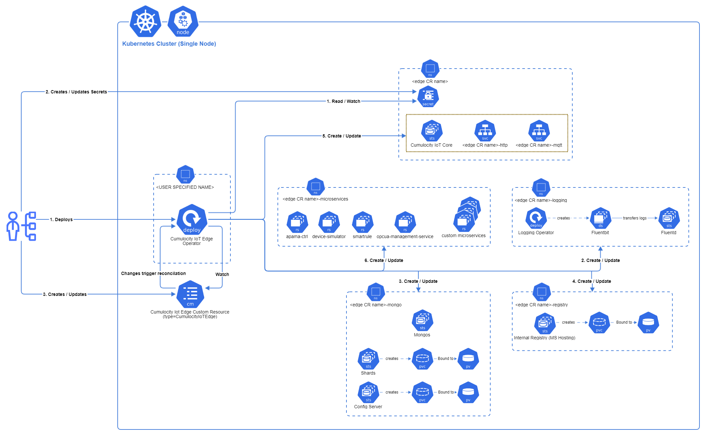

# Overview

The Cumulocity IoT Edge Kubernetes Operator automates the deployment and management of the Cumulocity IoT Edge on Kubernetes. The Operator manages a [Custom Resource Definition (CRD)](/crd/v1/edge.cumulocity.com_edges.yaml) to extend the Kubernetes API for Cumulocity IoT Edge.

You can deploy and manage the Cumulocity IoT Edge on a Kubernetes cluster, by updating Cumulocity IoT Edge Custom Resource (CR). Instead of making changes to the deployment by hand, you specify changes in the Cumulocity IoT Edge CR file and use `kubectl apply` to apply these changes. The Operator picks up the changes and does what it needs to do to make them happen.

This documentation includes examples of various [Cumulocity IoT Edge CR](/samples/cr/v1/) options and possibilities you can use to deploy Edge on Kubernetes.

Henceforth, Cumulocity IoT Edge will be referred to as Edge.

# Architecture

The Edge Kubernetes Operator has a custom controller (written in Go) that manages the lifecycle and the state of an Edge deployment. It does so by managing a CRD to extend the Kubernetes API for Edge deployment. Management and maintenance of the Edge deployment can be performed by updating the Edge CR.

The Operator is deployed in the namespace specified during the installation of the Operator or by default created in the 'edge-k8s-operator-system' namespace. As part of the Edge deployment, the Operator creates multiple Kubernetes resources in various namespaces and watches them. These namespaces names are prefixed with the Edge CR name. e.g. <EDGE-CR-NAME>, <EDGE-CR-NAME>-microservices, <EDGE-CR-NAME>-logging, <EDGE-CR-NAME>-mongodb and <EDGE-CR-NAME>-microservices-registry.



# Getting Started

> **DISCLAIMER**
> 
> Eary access release of the Cumulocity IoT Edge Kubernetes Operator is not meant for production deployments. Software AG doesn't support upgrades of the Edge deployments done using this version of the Operator.

## System Requirements

The Edge Kubernetes Operator deploys and manages Cumulocity IoT Edge, version 1014.0.x.

The Operator is supported on the following lightweight Kubernetes distributions:
* K3s version 1.21.x
* K3d version 5.2.x

### K3s

K3s is a certified lightweight Kubernetes distribution for IoT * Edge computing. K3s is packaged as a single <50MB binary that reduces the dependencies and steps needed to install, run and auto-update a production Kubernetes cluster. Refer to [Installing K3s](https://rancher.com/docs/k3s/latest/en/installation/) for the installation instructions.

### K3d

K3d is a lightweight wrapper to run K3s in docker. K3d makes it very easy to create single-node K3s clusters in docker, e.g. for local development on Kubernetes. Refer to [Installing K3d](https://k3d.io/v5.3.0/#installation) for the installation instructions.

> **INFO**
>
> If you want to manage the Kubernetes cluster from a remote machine, you will need `kubectl` installed on your client machine. Refer to [Installing kubectl](https://kubernetes.io/docs/tasks/tools/#kubectl) for the installation instructions. Ensure you verify and update the [kubectl configuration](https://kubernetes.io/docs/tasks/tools/install-kubectl-linux/#verify-kubectl-configuration) after installation.


## Install Operator

A Helm chart is provided for installing the Edge Kubernetes Operator. To begin, create a new **single node** Kubernetes cluster with the Kubernetes distribution of your choice, and configure kubectl to use that cluster. See the [System Requirements page](#system-requirements) for the supported Kubernetes distributions and versions.


> **INFO**
> 
> To use Helm charts, you need to install Helm v3. Refer to [Installing Heml](https://helm.sh/docs/intro/install/) for the installation instructions. 

### Requirements

For installing the Operator, you need a license key and credentials to access the Cumulocity IoT Edge repository. Please contact Andrej Schreiner (email: Andrej.Schreiner@softwareag.com), Product Manager, to get the necessary details.

### Get Helm Charts

Run this command after replacing `<EDGE-REPO-USERNAME>` and `<EDGE-REPO-PASSWORD>` with the Edge repository credentials you received, to add the Operator Helm charts repository to your helm and fetch the charts.

```bash
#
# Add the Operator Helm charts repository to your helm.
#

# Replace <USERNAME> and <PASSWORD> with the credentials you received
EDGE-REPO-USERNAME=<USERNAME>
EDGE-REPO-PASSWORD=<PASSWORD>

# This adds edge chart repository to your helm
helm repo add edge-repo https://registry.c8y.io/chartrepo/edge --username ${EDGE-REPO-USERNAME} --password ${EDGE-REPO-PASSWORD}>

# This fetches all the Helm charts available in the repo.
helm repo update
```

### Deploy Edge Kubernetes Operator

Run this command after replacing `<EDGE-REPO-USERNAME>` and `<EDGE-REPO-PASSWORD>` with the credentials you received to deploy the Operator.

By default, the Operator is deployed in `edge-k8s-operator-system` namespace. However, you can override by providing the `--namespace` and `--create-namespace` _(to create namespace if not present)_ options to the command.

```bash
#
# Deploy the Cumulocity IoT Edge Kubernetes Operator.
#

# Replace <USERNAME> and <PASSWORD> with the credentials you received
EDGE-REPO-USERNAME=<USERNAME>
EDGE-REPO-PASSWORD=<PASSWORD>

# Resolves the latest version of the Operator
EDGE-OPERATOR-VERSION=$(helm search repo edge-repo -o json | jq -r '.[] | select(.name | contains("edge-operator")).version')

# Deploys the Operator
# Pass --namespace and --create-namespace options to deploy in a specific namespace
helm install edge-k8s-operator edge-repo/edge-operator --version ${EDGE_VERSION} --set "imageCredentials.username=${EDGE-REPO-USERNAME}" --set "imageCredentials.password=${EDGE-REPO-PASSWORD}"
```

> **INFO**
> 
> We recommend not using the Edge Custom Resource (CR) name as Kubernetes Operator's namespace, as it is used for deploying one of the Edge components.


## Install Edge

To use the Edge Kubernetes Operator to deploy Cumulocity IoT Edge, create an Edge Custom Resource (CR) file which describes the Edge deployment. Then use `kubectl` to apply that configuration file to your Kubernetes cluster.

### Requirements

Before deploying the Cumulocity IoT Edge, you must [Install Operator](#install-operator) on your Kubernetes cluster using Helm.

### Domain Name System (DNS) setup

Kubernetes doesn't use CoreDNS server to resolve hostnames, rather it uses DNS servers listed in the `/etc/resolv.conf` of the Operating System. As the Cumulocity Core Platform needs DNS to resolve the microservices registry (Docker registry) host, you need to update `/etc/resolv.conf` file to add the IP address of the CoreDNS server to the top of the nameserver list.

Add `nameserver <IP address of CoreDNS>` to `/etc/resolv.conf` file.

If you are using Ubuntu 18.04 or later, the resolv.conf file is actually a symbolic link managed by Resolve daemon. In this case, you need to disable ResolveD before updating the file.

```bash
# Stop ResolveD service
sudo systemctl disable systemd-resolved.service
sudo systemctl stop systemd-resolved

# Remove the symbolic link created by the ResolveD
rm /etc/resolv.conf

# Create a new resolv.conf
touch /etc/resolv.conf
echo "nameserver <IP address of CoreDNS>" >> /etc/resolv.conf
echo "nameserver 8.8.8.8" >> /etc/resolv.conf
```

### Label Kubernetes node

Cumulocity core deployment needs kubernetes node to be labeled correctly. Node needs to have the label `nodetype=core`

Run this command to label the first node (in case your cluster has multiple nodes) returned by the 'get nodes' command.

```bash
# Labels the first node returned by the 'get nodes' command with nodetype=core
kubectl label nodes $(kubectl get nodes -o=jsonpath='{.items[0].metadata.name}') nodetype=core
```

### Prepare namespace

You need to create a namespace with Edge CR name and Kubernetes Secrets in that namespace necessary before deploying Edge.

#### Create namespace

Run this command after replacing `<EDGE-CR-NAME>` with Edge CR name, to create a Kubernetes namespace.

```bash
#
# Create a Kubernetes namespace
# Replace <EDGE-CR-NAME> with Edge CR name.
#
kubectl create namespace <EDGE-CR-NAME>
```

#### Create Secrets

Create Secrets to supply the Edge repository credentials, license, admin user credentials and other details securely to the Edge Operator.

Sample secret manifest files can be downloaded from [Secret manifest files](/samples/secret)

> **Note:** The Operator fetches the secrets from the namespace with the name of the Edge CR. Create these secrets before deploying or updating the Edge.

> **Caution**
>
> Kubernetes Secrets are, by default, stored unencrypted in the API server's underlying data store (etcd). Anyone with API access can retrieve or modify a Secret, and so can anyone with access to etcd. Additionally, anyone who is authorized to create a Pod in a namespace can use that access to read any Secret in that namespace; this includes indirect access such as the ability to create a Deployment.
>
> Follow the approach recommended by the Kubernetes distribution you are using to secure the secrets.

* Secret for supplying the Software AG Registry (registry.c8y.io) credentials to the Cumulocity IoT Edge Operator. 
  The Operator explicitly searches for the secret named `sag-registry-credentials`, so you can't change its name. See [Software AG Registry Credentials Secret](#software-ag-registry-credentials-secret) for details.

* Secret for supplying the Edge license key to the Cumulocity IoT Edge Operator.
  Name of this secret should be supplied to `spec.licenseSecretName` field of Edge CR. See [License Secret](#license-secret) for details.
  
* Secret for supplying the TLS Key/Certificates to the Cumulocity IoT Edge Operator.This secret is optional. If not provided the Operator generates and assigns self-signed certificates.
  Name of this secret should be supplied to `spec.tlsSecretName` field of Edge CR. See [TLS Secret](#tls-secret) for details.

* Secret for supplying the management/edge tenant's admin credentials to the Cumulocity IoT Edge Operator.
  Name of this secret should be supplied to `spec.adminCredentialsSecretName` field of Edge CR. See [Admin Credentials Secret](#admin-credentials-secret) for details.
  
* Secret for supplying credentials to connect to an externally hosted MongoDB server, to the Cumulocity IoT Edge Operator. This secret is optional. Only required if you want this Edge deployment to use an externally hosted MongoDB server.
  Name of this secret should be supplied to `mongoDb.credentialsSecretName` field of Edge CR. See [MongoDB Credentials Secret](#mongodb-credentials-secret) for details.

* Secret for supplying credentials to connect to an externally hosted Docker Registry (used to store Cumulocity microservice images) to the Cumulocity IoT Edge Operator. This secret is optional. Only required if you want this Edge deployment to use an externally hosted Docker Registry.
  Name of this secret should be supplied to `microservicesRegistry.credentialsSecretName` field of Edge CR. See [Microservices registry credentials secret](#microservices-registry-credentials-secret) for details.

* Secret for supplying server certificate of an externally hosted Docker Registry (used to store Cumulocity microservice images) to the Cumulocity IoT Edge Operator. This secret is optional. Only required if you want this Edge deployment to use an externally hosted Docker Registry. 
  Name of this secret should be supplied to `microservicesRegistry.tlsSecretName` field of Edge CR. See [Microservices Registry TLS secret](#microservices-registry-tls-secret) for details.

Create a manifest file with the required secrets and run this command passing the file you created.

```bash
#
# Create Secrets to provide the Edge repository credentials, license, admin user credentials to the Edge Operator.
# 
kubectl apply -f <PATH-TO-FILE>/secrets.yaml
```

### Create Edge Custom Resource (CR)

Refer to the [Edge Custom Resource Definition](#edge-custom-resource-definition) for structure of the Edge custom resource (CR) YAML file you need to create. You can edit the CR file at any time to make changes and manage the Edge deployment.

Find below a [Sample CR](/samples/cr/v1/cumulocity-iot-edge-cr.yaml).

```
---
#
# This CR deploys Edge version 1014.0.0 named 'cumulocity-iot-edge', with the below details
#  - myown.iot.com domain with self-signed tls certificates
#  - Cumulocity IoT Core and related pods in 'cumulocity-iot-edge' namespace
#  - MongoDB in the 'cumulocity-iot-edge-mongodb' namespace
#  - Docker Registry in the 'cumulocity-iot-edge-microservices-registry' namespace
#  - Logging components in the 'cumulocity-iot-edge-logging' namespace
#  - Apama, Smart Rules, Device Simulator and OPCUA Management Server microservices in the 'cumulocity-iot-edge-microservices' namespace
#  - Administration, Cockpit, Device Management and Apama Streaming Analytics applications
#

apiVersion: edge.cumulocity.com/v1
kind: Edge
metadata:
  name: cumulocity-iot-edge
spec:
  version: 1014.0.0
  licenseSecretName: license-secret
  company: iot.com
  domain: myown.iot.com
  adminCredentialsSecretName: admin-credentials-secret
```

This CR deploys Edge version 1014.0.0 named **"cumulocity-iot-edge"**, with the below details
* myown.iot.com domain with self-signed tls certificates
* Cumulocity IoT Core and related pods in `cumulocity-iot-edge` namespace
* MongoDB in the `cumulocity-iot-edge-mongodb` namespace
* Docker Registry in the `cumulocity-iot-edge-microservices-registry` namespace
* Logging components in the `cumulocity-iot-edge-logging` namespace
* Apama, Smart Rules, Device Simulator and OPCUA Management Server microservices in the `cumulocity-iot-edge-microservices` namespace
* Administration, Cockpit, Device Management and Apama Streaming Analytics applications

### Deploy Edge

Use the custom resource YAML file you created to deploy Edge. 

For example, you can deploy `cumulocity-iot-edge-cr.yaml` file with

```bash
kubectl apply -f cumulocity-iot-edge-cr.yaml
```

### Create Services and Ingress routes

TODO:

### Verify Edge deployment

TODO:

## Connect to Edge

TODO:

## Accessing logs

TODO:

## Troubleshooting

TODO:

# Edge Custom Resource Definition

Edge deployment settings are in the Edge Custom Resource (CR) YAML file. You can edit this file to make changes to your Edge deployment.

The [Custom Resource Definition (CRD)](/crd/v1/edge.cumulocity.com_edges.yaml) specifies the CR the Operator uses to manage Edge.

## Configuration

The initial part of the CR defines the CRD details, and the Edge deployment's name, referred to in this document as **`EDGE-CR-NAME`**.

```
apiVersion: edge.cumulocity.com/v1
kind: Edge
metadata:
  name: <EDGE-CR-NAME>
```

## Spec

The spec section defines the Edge deployment's configurations.

Field | Required | Type | Default | Description
----- | -------- | ---- | ------- | -----------
version | Yes | String |  | Cumulocity IoT Edge version to deploy.
licenseSecretName | Yes | String |  | Name of the Kubernetes Secret containing the Edge license key. See [License Secret](#license-secret) for details. <p>**Note:** The Operator fetches this secret from the namespace with the name of the Edge CR. Create this secret before deploying or updating the Edge.
company | Yes | String |  | Name of the edge tenant, e.g. the company's name.
domain | Yes | String |  | A fully qualified domain name. <p>For example, “myown.iot.com”. Here, you must have the Edge license for the domain name iot.com or myown.iot.com.
tlsSecretName| No | String | The Operator generates and assigns self-signed certificates. | Name of the Kubernetes Secret containing the TLS key and certificates for the name specified in the `spec.domain` field. See [TLS Secret](#tls-secret) for details. <p>**Note:** The Operator fetches this secret from the namespace with the name of the Edge CR. Create this secret before deploying or updating the Edge.
adminCredentialsSecretName| Yes | String |  | Name of the Kubernetes Secret containing the management/edge tenant's admin credentials. See [Admin Credentials Secret](#admin-credentials-secret) for details. <p>**Note:** The Operator fetches this secret from the namespace with the name of the Edge CR. Create this secret before deploying or updating the Edge.
core | Yes | Structure |  | Cumulocity IoT platform configurations. See [Cumulocity IoT Core configurations](#cumulocity-iot-core-configurations) for details.
microservices. | No | Array of Structure | The Operator deploys all the default Cumulocity microservices, which include the Apama, Smart Rules, SSL Management Server, Device Simulator and OPCUA Management Server microservices. |  Specify resources to allocate to a Cumulocity microservice and also to skip deploying the Device Simulator and/or OPCUA Management Server. See [Microservices](#microservices) for details.
applications | No | Array of Structure | The Operator deploys all default applications, which include the Administration, Cockpit, Device Management and Apama Streaming Analytics applications. | Specify the applications to skip deploying. For example, Apama Streaming Analytics application.  See [Applications](#applications) for details.
mongoDb | No | Structure | The Operator deploys a MongoDB server. |  See [MongoDB](#mongodb) for details.
microservicesRegistry | No | Structure | The Operator deploys a Docker registry (used to store Cumulocity microservice images). | See [Microservices Registry](#microservices-registry) for details.

## License Secret

Specifies the name of the Kubernetes Secret containing the Edge license key. The Operator fetches this secret from the namespace with the name of the Edge CR. Create this secret before deploying or updating the Edge. 

See sample [License secret manifest](/samples/secret/license-secret.yaml) file.

This secret should contain the fields described in the table below.

Field | Required | Type | Default | Description
----- | -------- | ---- | ------- | -----------
licence | Yes | String |  | Edge license key.

## TLS Secret

Specifies the name of the Kubernetes Secret containing the TLS Key/Certificates for the domain. The Operator fetches this secret from the namespace with the name of the Edge CR. Create this secret before deploying or updating the Edge.

See sample [TLS secret manifest](/samples/secret/tls-secret.yaml) file.

This secret should contain the fields described in the table below.

Field | Required | Type | Default | Description
----- | -------- | ---- | ------- | -----------
key | Yes | String |  | Private key for the domain.
certificateChain | Yes | String |  | Certificate chain of the private key for the domain.

## Admin Credentials Secret

Specifies the name of the Kubernetes Secret containing the management/edge tenant's admin credentials. The Operator fetches this secret from the namespace with the name of the Edge CR. Create this secret before deploying or updating the Edge.

See sample [Admin credentials secret manifest](/samples/secret/admin-credentials-secret.yaml) file.

This secret should contain the fields described in the table below.

Field | Required | Type | Default | Description
----- | -------- | ---- | ------- | -----------
username | Yes | String |  | admin username of the management and edge tenants.
password | Yes | String |  | admin user's password.
email | Yes | String |  | admin user's email id.

## Cumulocity IoT Core configurations

Core spec specifies the fields to configure Cumulocity IoT Core node and its resource limits.

Field | Required | Type | Default | Description
----- | -------- | ---- | ------- | -----------
coreValues | No | Structure |  | Cumulocity IoT Core node configurations. See [Cumulocity IoT Core values](#cumulocity-iot-core-values) for details
resources | No | Structure | Defaults to CPU Limit: 4000m, Memory Limit: 6G, CPU Requests: 1000m, Memory Requests: 1G | Specify resource limits for the Cumulocity IoT Core node container. See [Resource Limits Spec](#resource-limits-spec) for details.

## Cumulocity IoT Core values

Core values spec specifies the fields to configure Cumulocity IoT Core node.

Field | Required | Type | Default | Description
----- | -------- | ---- | ------- | -----------
managementTenantAllowedIPBlocks | No | Array of String | Defaults to allow all | Specify the IP address blocks to allow access to the Management tenant from only a specific range of IP addresses. Allowed to add multiple blocks. For example, 10.0.0.0/8
edgeTenantAllowedIPBlocks | No | Array of String | Defaults to allow all | Specify the IP address blocks to allow access to the Edge tenant from only a specific range of IP addresses. Allowed to add multiple blocks.

## Microservices

Microservices spec allows to specify resources to allocate to a Cumulocity microservice and also to skip deploying the Device Simulator and/or OPCUA Management Server. If not specified, the Operator deploys all the default Cumulocity microservices, which include the Apama, Smart Rules, SSL Management Server, Device Simulator and OPCUA Management Server microservices.

Field | Required | Type | Default | Description
----- | -------- | ---- | ------- | -----------
name | Yes | String |  | Name of the Cumulocity microservice. Allowed values are apama-ctrl, smartrule, ssl-management-server, device-simulator and opcua-mgmt-service
disable | No | boolean | false | Specify 'true' to, not deploy or undeploy the microservice. <p>**Note:** Only device-simulator and opcua-mgmt-service services can be undeployed, as the rest of the services are essential for the functioning of the Cumulocity IoT Platform.  
resources | No | Structure | | Specify resource limits for the microservice container. See [Resource Limits Spec](#resource-limits-spec) for details.

## Applications
Applications spec allows to specify the applications to skip deploying. For example, Apama Streaming Analytics application. If not specified, the Operator deploys all default applications, which include the Administration, Cockpit, Device Management and Apama Streaming Analytics applications.

Field | Required | Type | Default | Description
----- | -------- | ---- | ------- | -----------
name | Yes | String |  | Name of the Cumulocity application. Allowed value is streaming-analytics
disable | No | boolean | false | Specify 'true' to, not deploy or undeploy the application. <p>**Note:** Only streaming-analytics application can be undeployed, as the rest of the applications are essential for the functioning of the Cumulocity IoT Platform.

## MongoDb

This field is necessary when this Edge deployment needs to be configured to use an externally hosted MongoDB server or to specify resource limits for the MongoDB server containers deployed by the Operator.

Field | Required | Type | Default | Description
----- | -------- | ---- | ------- | -----------
host | No | String | The Operator deploys a MongoDB server. | Hostname/connection string to connect to an externally hosted MongoDB server.
credentialsSecretName | No | String |  | Name of the Kubernetes Secret containing the credentials and sharded key to connect to an externally hosted MongoDB server. See [MongoDB Credentials Secret](#mongodb-credentials-secret) for details. <p>**Note:** The Operator fetches this secret from the namespace with the name of the Edge CR. Create this secret before deploying or updating the Edge.
mongosResources | No | Structure | Defaults to CPU Limit: 4000m, Memory Limit: 6G, CPU Requests: 1000m, Memory Requests: 1G | Specify resource limits for the mongos container. See [Resource Limits Spec](#resource-limits-spec) for details.
configSvrResources | No | Structure | Defaults to CPU Limit: 4000m, Memory Limit: 6G, CPU Requests: 1000m, Memory Requests: 1G | Specify resource limits for the config server container. See [Resource Limits Spec](#resource-limits-spec) for details.
shardSvrResources | No | Structure | Defaults to CPU Limit: 4000m, Memory Limit: 6G, CPU Requests: 1000m, Memory Requests: 1G | Specify resource limits for the shard server container. See [Resource Limits Spec](#resource-limits-spec) for details.
arbiterResources | No | Structure | Defaults to CPU Limit: 4000m, Memory Limit: 6G, CPU Requests: 1000m, Memory Requests: 1G | Limits the Specify resource limits for the arbiter container. See [Resource Limits Spec](#resource-limits-spec) for details.

## MongoDB Credentials Secret

Specifies the name of the Kubernetes Secret containing the credentials to connect to an externally hosted MongoDB server. The Operator fetches this secret from the namespace with the name of the Edge CR. Create this secret before deploying or updating the Edge.

See sample [MongoDB credentials secret manifest](/samples/secret/mongodb-credentials-secret.yaml) file.

This secret should contain the fields described in the table below.

Field | Required | Type | Default | Description
----- | -------- | ---- | ------- | -----------
username | Yes | String |  | Username to connect to an externally hosted MongoDB server.
password | Yes | String |  | Password to connect to an externally hosted MongoDB server.
shardedKey | Yes | String |  | Sharded key to connect to an externally hosted MongoDB server.

## Microservices Registry

This field is necessary when this Edge deployment needs to be configured to use an externally hosted Docker registry or to specify resource limits for the Docker registry containers deployed by the Operator.

Field | Required | Type | Default | Description
----- | -------- | ---- | ------- | -----------
url | No | String | The Operator deploys a Docker registry. | URL to connect to an externally hosted Docker registry.
credentialsSecretName | No | String |  | Name of the Kubernetes Secret containing the credentials to connect to an externally hosted Docker registry. See [Microservices registry credentials secret](#microservices-registry-credentials-secret) for details. <p>**Note:** The Operator fetches this secret from the namespace with the name of the Edge CR. Create this secret before deploying or updating the Edge.
tlsSecretName | No | String |  | Name of the Kubernetes Secret containing the server certificate of an externally hosted Docker registry. See [Microservices Registry TLS secret](#microservices-registry-tls-secret) for details. <p>**Note:** The Operator fetches this secret from the namespace with the name of the Edge CR. Create this secret before deploying or updating the Edge.
resources | No | Structure | Defaults to CPU Limit: 4000m, Memory Limit: 6G, CPU Requests: 1000m, Memory Requests: 1G | Specify resource limits for the Docker Registry container. See [Resource Limits Spec](#resource-limits-spec) for details.

## Microservices Registry Credentials Secret

Specifies the name of the Kubernetes Secret containing the credentials to connect to an externally hosted Docker registry (used to store Cumulocity microservice images). The Operator fetches this secret from the namespace with the name of the Edge CR. Create this secret before deploying or updating the Edge.

See sample [Microservices registry credentials secret manifest](/samples/secret/microservices-registry-credentials-secret.yaml) file.

This secret should contain the fields described in the table below.

Field | Required | Type | Default | Description
----- | -------- | ---- | ------- | -----------
username | Yes | String |  | Username to connect to an externally hosted Docker registry.
password | Yes | String |  | Password to connect to an externally hosted Docker registry.

## Microservices Registry TLS Secret

Specifies the name of the Kubernetes Secret containing the server certificate of an externally hosted Docker registry. The Operator fetches this secret from the namespace with the name of the Edge CR. Create this secret before deploying or updating the Edge.

See sample [Microservices registry TLS secret manifest](/samples/secret/microservices-registry-tls-secret.yaml) file.

This secret should contain the fields described in the table below.

Field | Required | Type | Default | Description
----- | -------- | ---- | ------- | -----------
certificate | Yes | String |  | Externally hosted Docker Registry's server certificate.

## Resource Limits Spec

Structure for specifying the resource limits for the Operator deployed containers.

Field | Required | Type | Default | Description
----- | -------- | ---- | ------- | -----------
limitCpu | No | String |  | Specific CPU limit in cpu units. For example, 1000m or 1
limitMemory | No | String |  | Specific memory limit in memory units. For example, 1000M or 1G
requestsCpu | No | String |  | Specific CPU requests in cpu units. For example, 1000m or 1
requestsMemory | No | String |  | Specific memory requests in memory units. For example, 1000M or 1G

## Software AG Registry Credentials Secret

This secret named `sag-registry-credentials` is required to supply the Software AG Registry (registry.c8y.io) credentials to the Operator. The Operator explicitly searches for the secret named `sag-registry-credentials`, so you can't change its name. Create this secret before deploying or updating the Edge.

See sample [Software AG Registry Credentials Secret manifest](/samples/secret/sag-registry-credentials-secret.yaml) file.

This secret should contain the fields described in the table below.

Field | Required | Type | Default | Description
----- | -------- | ---- | ------- | -----------
username | Yes | String |  | Edge Repo username you received.
password | Yes | String |  | Edge Repo password you received.

# Management

## Modify Edge deployment

The Edge Kubernetes Operator makes it easier for you to use Edge on Kubernetes. Instead of making changes to the Edge deployment by hand, you specify changes in the Edge CR file, then use `kubectl apply` to apply these changes. The Operator picks up on the changes and does what it needs to do in order to make them happen.

For this example assume that the Edge was deployed using the file [Sample CR](/samples/cr/v1/cumulocity-iot-edge-cr.yaml).

### Example Configuration Change

Change the `spec.domain` field to `edge.myown.iot.com` and if required update the [License Secret](#license-secret) accordingly.

```
---
#
# This CR deploys Edge version 1014.0.0 named 'cumulocity-iot-edge', with the below details
#  - myown.iot.com domain with self-signed tls certificates
#  - Cumulocity IoT Core and related pods in 'cumulocity-iot-edge' namespace
#  - MongoDB in the 'cumulocity-iot-edge-mongodb' namespace
#  - Docker Registry in the 'cumulocity-iot-edge-microservices-registry' namespace
#  - Logging components in the 'cumulocity-iot-edge-logging' namespace
#  - Apama, Smart Rules, Device Simulator and OPCUA Management Server microservices in the 'cumulocity-iot-edge-microservices' namespace
#  - Administration, Cockpit, Device Management and Apama Streaming Analytics applications
#

apiVersion: edge.cumulocity.com/v1
kind: Edge
metadata:
  name: cumulocity-iot-edge
spec:
  version: 1014.0.0
  licenseSecretName: license-secret
  company: iot.com
  domain: edge.myown.iot.com
  adminCredentialsSecretName: admin-credentials-secret
```

Save the CR file, then use `kubectl` to apply the change.

```bash
kubectl apply -f cumulocity-iot-edge-cr-updated.yaml
```

Post this, follow the steps in [Verify Edge deployment](#verify-edge-deployment) to verify the Edge deployment.

## Version upgrade

The Operator follows the recreate update strategy to upgrade of the Edge deployment. 

The recreate update strategy is an all-or-nothing process that updates all aspects of the system at once with a brief downtime period. The Operator selects all outdated Pods and deactivates them at once. Once all old Pods are deactivated, the Operator creates updated Pods for the entire system. Edge is inoperable starting at the old Pod’s deactivation and ending once the final updated Pod is created.

For this example assume that cluster is deployed using the file [Sample CR](/samples/cr/v1/cumulocity-iot-edge-cr.yaml).

### Start the Upgrade

To upgrade the Edge deployment, change the `sepc.version` field in the Edge CR to the desired version.

```
---
#
# This CR deploys Edge version 1014.0.0 named 'cumulocity-iot-edge', with the below details
#  - myown.iot.com domain with self-signed tls certificates
#  - Cumulocity IoT Core and related pods in 'cumulocity-iot-edge' namespace
#  - MongoDB in the 'cumulocity-iot-edge-mongodb' namespace
#  - Docker Registry in the 'cumulocity-iot-edge-microservices-registry' namespace
#  - Logging components in the 'cumulocity-iot-edge-logging' namespace
#  - Apama, Smart Rules, Device Simulator and OPCUA Management Server microservices in the 'cumulocity-iot-edge-microservices' namespace
#  - Administration, Cockpit, Device Management and Apama Streaming Analytics applications
#

apiVersion: edge.cumulocity.com/v1
kind: Edge
metadata:
  name: cumulocity-iot-edge
spec:
  version: 1014.0.1
  licenseSecretName: license-secret
  company: iot.com
  domain: myown.iot.com
  adminCredentialsSecretName: admin-credentials-secret
```

Save the CR file, then use `kubectl` to apply the change.

```bash
kubectl apply -f cumulocity-iot-edge-cr-updated.yaml
```

Post this, follow the steps in [Verify Edge deployment](#verify-edge-deployment) to verify the Edge deployment.

## Undeploy Edge

You can undeploy Edge either by using the Edge CR file, or by deleting the cluster directly as you usually would.

Use `kubectl delete` to delete the Edge deployment using its CR file.

For example, you can undeploy `cumulocity-iot-edge` by executing this command.

```bash
kubectl delete -f cumulocity-iot-edge-cr.yaml
```

# Upgrade Operator
To upgrade the Operator you need to update the local edge-repo by following the steps described in [Get Helm Charts](#get-helm-charts).

Run this command after replacing `<EDGE-REPO-USERNAME>` and `<EDGE-REPO-PASSWORD>` with the credentials you received to deploy the Operator.

```bash
#
# Deploy the Cumulocity IoT Edge Kubernetes Operator.
#

# Replace <USERNAME> and <PASSWORD> with the credentials you received
EDGE-REPO-USERNAME=<USERNAME>
EDGE-REPO-PASSWORD=<PASSWORD>

# Resolves the latest version of the Operator
EDGE-OPERATOR-VERSION=$(helm search repo edge-repo -o json | jq -r '.[] | select(.name | contains("edge-operator")).version')

# Deploys the Operator
# Pass --namespace and --create-namespace options to deploy in a specific namespace
helm upgrade edge-k8s-operator edge-repo/edge-operator --version ${EDGE_VERSION} --set "imageCredentials.username=${EDGE-REPO-USERNAME}" --set "imageCredentials.password=${EDGE-REPO-PASSWORD}"
```

We recommend you to upgrade the Operator to the latest version. However, if you want to upgrade to a specific version, you can pass the version of the Operator to the `helm upgrade...` command via the option `--version`.
